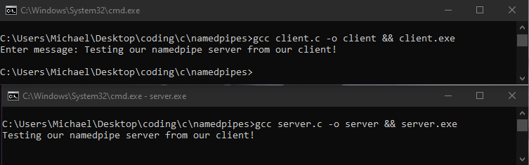

### Named Pipe Experiment

Having two processes communicate with one another (interprocess communications or IPC) using named pipes in C. Below shows a named pipe client sending a message to a named pipe server.

